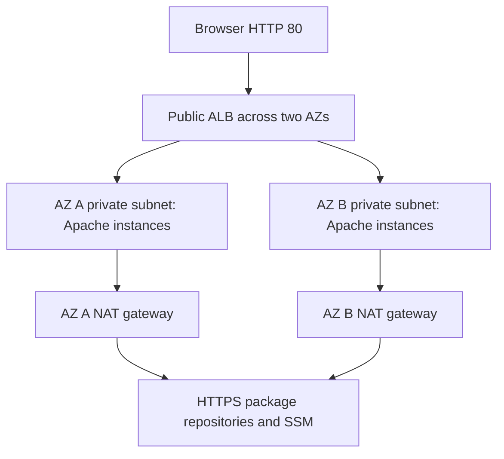

# Udagram: two-AZ AWS infrastructure demonstration

A CloudFormation case study based on the Udacity Udagram infrastructure exercise. A public Application Load Balancer forwards HTTP to four private Apache EC2 instances across two Availability Zones. Each private subnet has its own NAT gateway. The page is a small infrastructure demo, not an Instagram application.




## What this demonstrates

- Two-AZ routing, private compute, per-AZ outbound NAT and cross-stack exports.
- ALB health checks and instance replacement using an Auto Scaling group.
- **Fixed capacity:** min, desired and max are all four. No load-driven scaling policy is included.
- A region-resolved Amazon Linux 2023 image, launch template, IMDSv2 and encrypted root disks.
- HTTP ingress to instances only from the load balancer, no SSH ingress, and a Systems Manager instance role instead of the previous unrestricted IAM policy.

This revision corrects the old comma-separated subnet import, replaces the legacy launch configuration/hard-coded AMI, and supplies repeatable validation and operating instructions. There is no fresh cloud deployment or measured availability result. HTTP-only transport, lack of application/database state and missing production monitoring remain deliberate demo limits.

## Start here

| Path | Purpose |
| --- | --- |
| `UdagranInfrastructure.yaml` | Network, NAT and Systems Manager profile; original filename retained |
| `UdagramServers.yaml` | ALB, target group, launch template and fixed-capacity group |
| `network-parameters.json`, `server-parameters.json` | Example CloudFormation parameters; environment prefixes must match |
| [AWS EC2 / Apache / EBS lab](labs/ec2-apache-ebs/README.md) | Consolidated working lab with AWS CLI, verification and teardown |
| [Recovery exercise](labs/recovery/README.md) | Attributed historical VPC/ECS examples and an honest recovery runbook |
| [Source history](docs/history/README.md) | Preserved diagram, documentation and template differences from related repositories |

## Validate without deploying

Install Python 3.11+ and run:

```sh
python -m pip install -r requirements-validation.txt
cfn-lint UdagranInfrastructure.yaml UdagramServers.yaml labs/ec2-apache-ebs/template.yaml labs/recovery/*.yaml
python -m unittest discover -s tests -v
bash -n labs/ec2-apache-ebs/mount-data-volume.sh
shellcheck labs/ec2-apache-ebs/mount-data-volume.sh
```

CI runs these checks without AWS credentials. Static checks do not prove service quotas, instance boot, actual recovery or an AWS deployment. The tests exercise the CLI command construction and failure handling with a mocked AWS executable.

## Deploy and verify deliberately

Use AWS CLI v2 and an authenticated account with CloudFormation, VPC/EC2, IAM, Auto Scaling, SSM and ELB permissions. Choose a region with at least two AZs and quota for four EC2 instances and two NAT gateways. NAT gateways, ALB, EC2, EBS and public IPv4 incur costs. Review the templates and parameter files before creating them.

```sh
export AWS_REGION=us-east-1
aws cloudformation create-stack --stack-name udagram-network --template-body file://UdagranInfrastructure.yaml --parameters file://network-parameters.json --capabilities CAPABILITY_IAM
aws cloudformation wait stack-create-complete --stack-name udagram-network
aws cloudformation create-stack --stack-name udagram-servers --template-body file://UdagramServers.yaml --parameters file://server-parameters.json
aws cloudformation wait stack-create-complete --stack-name udagram-servers
aws cloudformation describe-stacks --stack-name udagram-servers --query 'Stacks[0].Outputs'
```

Use the returned Website URL with `curl --fail`. Use TargetGroupArn with `aws elbv2 describe-target-health --target-group-arn <arn>` and confirm all four targets become healthy. Stack completion alone does not confirm user-data success. With an SSM session inspect `sudo cloud-init status --wait`, `systemctl status httpd`, and `/var/log/cloud-init-output.log` when diagnosing a target. Record region, commit, stack events, health checks and timestamp if publishing deployment evidence.

For an update use `aws cloudformation update-stack` with the same template/parameter flags and then `aws cloudformation wait stack-update-complete`; update network first, then servers. Review changes before applying them to any pre-existing environment. Server launch changes roll instances one at a time with a pause; this is not a tested zero-downtime guarantee.

## Teardown

Delete the importing server stack before the network stack:

```sh
aws cloudformation delete-stack --stack-name udagram-servers
aws cloudformation wait stack-delete-complete --stack-name udagram-servers
aws cloudformation delete-stack --stack-name udagram-network
aws cloudformation wait stack-delete-complete --stack-name udagram-network
```

Verify the stacks and their NAT gateways, EIPs, ALB and instances have been removed. The small consolidated lab has its own independent teardown command. Existing `.bat` helpers remain historical shortcuts with a fixed region; the explicit commands above are the maintained instructions.

## Attribution and documentation

The original project identifies the Udacity infrastructure exercise. The preserved `-IaC-Project` variant uses the same network/helpers, adds a key-pair line, and contains a different diagram and longer explanation. Those differences are retained in [history](docs/history/README.md); the maintained configuration uses SSM instead of a hard-coded SSH key. No personal authorship or live client delivery is inferred from copied source. Existing notices and ownership continue to apply; this consolidation does not grant a new license.

References: [AWS AL2023 on EC2](https://docs.aws.amazon.com/linux/al2023/ug/ec2.html), [CloudFormation launch templates](https://docs.aws.amazon.com/AWSCloudFormation/latest/TemplateReference/aws-resource-ec2-launchtemplate.html), and [EBS volume identification](https://docs.aws.amazon.com/ebs/latest/userguide/identify-nvme-ebs-device.html).
